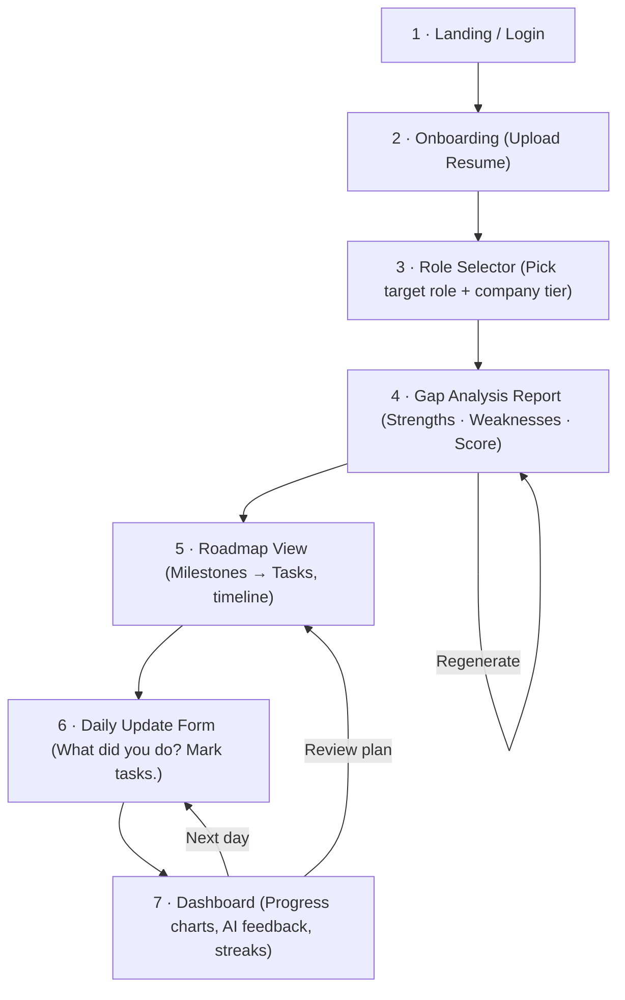

# AI Career Operating System — V1 Design

> Help software engineers switch to product companies through AI-driven gap analysis, personalized roadmaps, and daily progress tracking.

---

## 1. Core Entities

| Entity | Purpose |
|---|---|
| **User** | The engineer using the platform |
| **Resume** | Uploaded resume (raw file + parsed data) |
| **TargetRole** | The role the user is aiming for (e.g., SDE-2 @ Google) |
| **GapAnalysis** | AI-generated comparison: current profile vs. target role requirements |
| **Roadmap** | AI-generated learning/action plan with milestones |
| **Milestone** | A major checkpoint inside a roadmap (e.g., "Complete System Design basics") |
| **Task** | An atomic action item inside a milestone (e.g., "Solve 10 medium graph problems") |
| **DailyUpdate** | User's self-reported progress for the day |
| **ProgressSnapshot** | AI-computed progress state after each daily update |

---

## 2. Database Schema

```sql
-- ==================== USERS ====================
CREATE TABLE users (
    id              UUID PRIMARY KEY DEFAULT gen_random_uuid(),
    email           VARCHAR(255) UNIQUE NOT NULL,
    name            VARCHAR(255) NOT NULL,
    password_hash   VARCHAR(255) NOT NULL,
    created_at      TIMESTAMPTZ DEFAULT now(),
    updated_at      TIMESTAMPTZ DEFAULT now()
);

-- ==================== RESUMES ====================
CREATE TABLE resumes (
    id              UUID PRIMARY KEY DEFAULT gen_random_uuid(),
    user_id         UUID NOT NULL REFERENCES users(id) ON DELETE CASCADE,
    file_url        TEXT NOT NULL,               -- S3 / cloud storage path
    parsed_json     JSONB,                       -- structured extraction from AI
    uploaded_at     TIMESTAMPTZ DEFAULT now()
);
CREATE INDEX idx_resumes_user ON resumes(user_id);

-- ==================== TARGET ROLES ====================
CREATE TABLE target_roles (
    id              UUID PRIMARY KEY DEFAULT gen_random_uuid(),
    user_id         UUID NOT NULL REFERENCES users(id) ON DELETE CASCADE,
    title           VARCHAR(255) NOT NULL,       -- e.g. "SDE-2"
    company_tier    VARCHAR(50),                  -- e.g. "FAANG", "Unicorn", "Series-B"
    yoe_required    INT,                          -- typical years of experience
    key_skills      JSONB,                        -- ["System Design", "DSA", "React"]
    created_at      TIMESTAMPTZ DEFAULT now()
);
CREATE INDEX idx_target_roles_user ON target_roles(user_id);

-- ==================== GAP ANALYSIS ====================
CREATE TABLE gap_analyses (
    id              UUID PRIMARY KEY DEFAULT gen_random_uuid(),
    user_id         UUID NOT NULL REFERENCES users(id) ON DELETE CASCADE,
    resume_id       UUID NOT NULL REFERENCES resumes(id),
    target_role_id  UUID NOT NULL REFERENCES target_roles(id),
    strengths       JSONB,                       -- ["Strong in backend", "Good Go exp"]
    weaknesses      JSONB,                       -- ["No system design", "Weak DSA"]
    score           INT CHECK (score BETWEEN 0 AND 100),
    generated_at    TIMESTAMPTZ DEFAULT now()
);
CREATE INDEX idx_gap_user ON gap_analyses(user_id);

-- ==================== ROADMAPS ====================
CREATE TABLE roadmaps (
    id              UUID PRIMARY KEY DEFAULT gen_random_uuid(),
    user_id         UUID NOT NULL REFERENCES users(id) ON DELETE CASCADE,
    gap_analysis_id UUID NOT NULL REFERENCES gap_analyses(id),
    title           VARCHAR(255) NOT NULL,
    status          VARCHAR(20) DEFAULT 'active'
                        CHECK (status IN ('active','paused','completed','abandoned')),
    target_date     DATE,
    created_at      TIMESTAMPTZ DEFAULT now(),
    updated_at      TIMESTAMPTZ DEFAULT now()
);
CREATE INDEX idx_roadmaps_user ON roadmaps(user_id);

-- ==================== MILESTONES ====================
CREATE TABLE milestones (
    id              UUID PRIMARY KEY DEFAULT gen_random_uuid(),
    roadmap_id      UUID NOT NULL REFERENCES roadmaps(id) ON DELETE CASCADE,
    title           VARCHAR(255) NOT NULL,       -- "Master System Design Fundamentals"
    description     TEXT,
    sort_order      INT NOT NULL,
    status          VARCHAR(20) DEFAULT 'pending'
                        CHECK (status IN ('pending','in_progress','completed','skipped')),
    target_date     DATE,
    created_at      TIMESTAMPTZ DEFAULT now()
);
CREATE INDEX idx_milestones_roadmap ON milestones(roadmap_id);

-- ==================== TASKS ====================
CREATE TABLE tasks (
    id              UUID PRIMARY KEY DEFAULT gen_random_uuid(),
    milestone_id    UUID NOT NULL REFERENCES milestones(id) ON DELETE CASCADE,
    title           VARCHAR(255) NOT NULL,       -- "Solve 10 medium graph problems"
    description     TEXT,
    resource_url    TEXT,                         -- optional link to resource
    sort_order      INT NOT NULL,
    status          VARCHAR(20) DEFAULT 'pending'
                        CHECK (status IN ('pending','in_progress','completed','skipped')),
    created_at      TIMESTAMPTZ DEFAULT now()
);
CREATE INDEX idx_tasks_milestone ON tasks(milestone_id);

-- ==================== DAILY UPDATES ====================
CREATE TABLE daily_updates (
    id              UUID PRIMARY KEY DEFAULT gen_random_uuid(),
    user_id         UUID NOT NULL REFERENCES users(id) ON DELETE CASCADE,
    roadmap_id      UUID NOT NULL REFERENCES roadmaps(id),
    update_date     DATE NOT NULL,
    summary         TEXT NOT NULL,               -- free-text: what I did today
    tasks_completed UUID[],                      -- array of task IDs marked done
    hours_spent     NUMERIC(4,1),
    blockers        TEXT,
    created_at      TIMESTAMPTZ DEFAULT now(),
    UNIQUE(user_id, roadmap_id, update_date)     -- one update per day per roadmap
);
CREATE INDEX idx_daily_user ON daily_updates(user_id);

-- ==================== PROGRESS SNAPSHOTS ====================
CREATE TABLE progress_snapshots (
    id              UUID PRIMARY KEY DEFAULT gen_random_uuid(),
    roadmap_id      UUID NOT NULL REFERENCES roadmaps(id) ON DELETE CASCADE,
    daily_update_id UUID REFERENCES daily_updates(id),
    overall_pct     INT CHECK (overall_pct BETWEEN 0 AND 100),
    milestone_pcts  JSONB,                       -- { "milestone_id": 60, ... }
    ai_feedback     TEXT,                        -- "You're ahead on DSA, behind on SD"
    computed_at     TIMESTAMPTZ DEFAULT now()
);
CREATE INDEX idx_snapshots_roadmap ON progress_snapshots(roadmap_id);
```

---

## 3. REST API Design

### Auth
| Method | Endpoint | Description |
|--------|----------|-------------|
| POST | `/api/auth/register` | Create account |
| POST | `/api/auth/login` | Login, returns JWT |

### Resume
| Method | Endpoint | Description |
|--------|----------|-------------|
| POST | `/api/resumes` | Upload resume (multipart) |
| GET | `/api/resumes/latest` | Get latest parsed resume |

### Target Roles
| Method | Endpoint | Description |
|--------|----------|-------------|
| GET | `/api/target-roles/templates` | List preset roles (SDE-1, SDE-2, etc.) |
| POST | `/api/target-roles` | Select / customize a target role |

### Gap Analysis
| Method | Endpoint | Description |
|--------|----------|-------------|
| POST | `/api/gap-analysis` | Trigger AI gap analysis (resume + target) |
| GET | `/api/gap-analysis/:id` | Get gap analysis result |

### Roadmap
| Method | Endpoint | Description |
|--------|----------|-------------|
| POST | `/api/roadmaps` | Generate roadmap from gap analysis |
| GET | `/api/roadmaps/:id` | Get roadmap with milestones & tasks |
| PATCH | `/api/roadmaps/:id` | Update status (pause/resume/abandon) |

### Tasks
| Method | Endpoint | Description |
|--------|----------|-------------|
| PATCH | `/api/tasks/:id` | Mark task complete / skip |

### Daily Updates
| Method | Endpoint | Description |
|--------|----------|-------------|
| POST | `/api/daily-updates` | Submit daily update |
| GET | `/api/daily-updates?from=&to=` | List past updates (date range) |

### Progress
| Method | Endpoint | Description |
|--------|----------|-------------|
| GET | `/api/progress/:roadmapId` | Latest progress snapshot |
| GET | `/api/progress/:roadmapId/history` | Progress over time (for charts) |

---

## 4. Screen Flow



### Screen Details

| # | Screen | Key Elements |
|---|--------|-------------|
| 1 | **Landing / Login** | Email + password, or OAuth. One-liner value prop. |
| 2 | **Upload Resume** | Drag-and-drop PDF upload. Shows parsing progress. |
| 3 | **Role Selector** | Cards for preset roles (SDE-1, SDE-2, Staff, Frontend, Backend). Option to customize skills. |
| 4 | **Gap Analysis** | Radar chart of skills, strengths in green, gaps in red, overall readiness score. CTA: "Generate Roadmap". |
| 5 | **Roadmap** | Vertical timeline of milestones. Each expands into tasks with checkboxes. Target date shown. |
| 6 | **Daily Update** | Text area for summary, task checklist, hours spent, blockers field. |
| 7 | **Dashboard** | Overall % progress ring, milestone progress bars, streak counter, latest AI feedback card. |

---

## 5. What to **NOT** Include in V1

| Feature | Why Defer |
|---------|-----------|
| **Social / Community** | Adds moderation complexity; focus on single-user loop first |
| **Mock Interview Scheduling** | Requires calendar + video integration — too broad for V1 |
| **Job Board / Auto-Apply** | Separate product surface; V1 is about preparation, not applications |
| **Payment / Subscription** | Get product-market fit first, then monetize |
| **Mobile App** | Ship responsive web first; native app can come later |
| **Mentor Matching** | Two-sided marketplace is a separate challenge |
| **Detailed Analytics / Heatmaps** | Basic progress chart is enough; deep analytics is premature |
| **Resume Tailoring per Company** | V1 focuses on skill gaps, not resume rewriting |
| **Multi-role Tracking** | Support one active roadmap at a time in V1 |
| **Notification System (email / push)** | Nice-to-have; not core to proving the loop |
| **Admin Panel** | Not needed until there are operations to manage |

---

## 6. Suggested Tech Stack (Lean V1)

| Layer | Choice | Rationale |
|-------|--------|-----------|
| Frontend | **Next.js** (App Router) | SSR, file-based routing, fast iteration |
| Styling | **Tailwind CSS** | Rapid UI, responsive out of the box |
| Backend | **Next.js API Routes** or **Express** | Keeps it in one repo for V1 |
| Database | **PostgreSQL** (Supabase or Neon) | Relational + JSONB for flexibility |
| AI | **OpenAI GPT-4o** via API | Gap analysis + roadmap generation |
| Auth | **NextAuth.js** | Quick OAuth + credentials setup |
| Storage | **S3 / Cloudflare R2** | Resume file uploads |
| Hosting | **Vercel** | Zero-config deploy for Next.js |

---

## 7. V1 Success Criteria

1. A user can go from **resume upload → gap analysis → roadmap** in under 3 minutes.
2. Daily updates are fast (<1 min to submit).
3. Progress dashboard updates after each daily submission.
4. AI feedback feels personalized and actionable, not generic.

---

Let me know if you'd like me to adjust scope, change the schema, or start building any part of this!